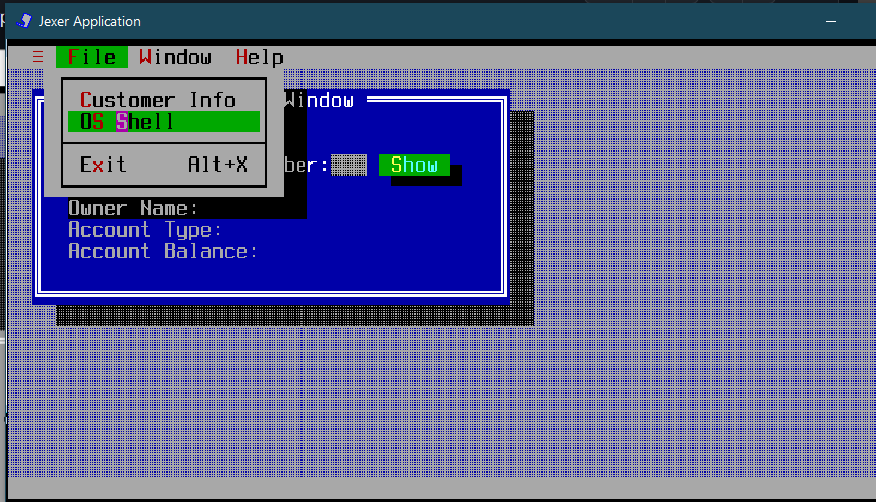

# UI Lab 1


# Резултьати запуску:





# Метод ShowCustomerDetails :

````java

/** 
 *
 * It is a constructor. 
 *
 */
private void ShowCustomerDetails() { 

    TWindow custWin = addWindow("Customer Window", 2, 1, 40, 10, TWindow.NOZOOMBOX);
    custWin.newStatusBar("Enter valid customer number and press Show...");

    custWin.addLabel("Enter customer number: ", 2, 2);
    TField custNo = custWin.addField(24, 2, 3, false);
    TText details = custWin.addText("Owner Name: \nAccount Type: \nAccount Balance: ", 2, 4, 38, 8);
    custWin.addButton("&Show", 28, 2, new TAction() {
        @Override

/** 
 *
 * It is a constructor. 
 *
 */
        public void DO() { 

            try {
                int custNum = Integer.parseInt(custNo.getText());
                // Get customer from the bank
                Bank bank = new Bank();
                Customer customer = bank.getCustomer(custNum);

                if (customer != null) {
                    // Get the first account of the customer
                    Account account = customer.getAccount(0);

                    // Display customer details
                    String ownerName = customer.getFirstName() + " " + customer.getLastName();
                    String accountType = account instanceof CheckingAccount ? "Checking" : "Savings";
                    double accountBalance = account.getBalance();

                    details.setText("Owner Name: " + ownerName + " (id=" + custNum + ")\n" +
                                    "Account Type: " + accountType + "\n" +
                                    "Account Balance: $" + accountBalance);
                } else {
                    details.setText("Customer not found.");
                }
            } catch (Exception e) {
                messageBox("Error", "You must provide a valid customer number!").show();
            }
        }
    });
}
````
